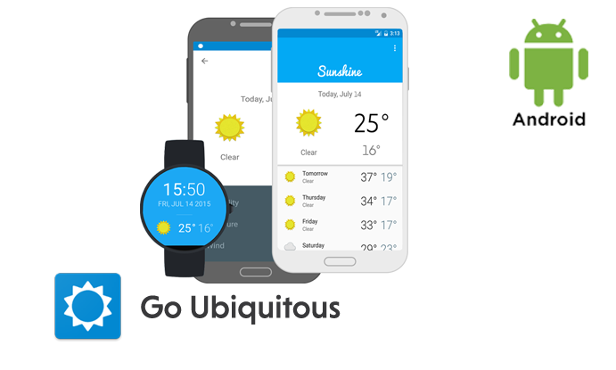

# Udacity Go Ubiquitous



## Project description

Built a watch face for Android Wear so users can access Sunshine's weather information at a glance.

[Screenshots](Screenshots/)

## Libraries
 * [Support Design libraries](https://developer.android.com/topic/libraries/support-library/features.html) - Material design library
 * [Glide](https://github.com/bumptech/glide) - An image loading and caching library for Android focused on smooth scrolling
 * [Android Wearable](https://developer.android.com/training/wearables/apps/index.html) - Android Wearable library
 * [Google Play Services](https://developers.google.com/android/guides/setup) - Google Play Services
 * [Google Play Services Wearable](https://developer.android.com/training/wearables/apps/index.html) - Google Play Services Wearable

 ## Udacity Nanodegree Go Ubiquitous Project

 

  # License - Apache License, Version 2.0

  ```
  # (C) Copyright 2016 by Marek Hakala <hakala.marek@gmail.com>
  # Licensed under the Apache License, Version 2.0 (the "License");
  # you may not use this file except in compliance with the License.
  # You may obtain a copy of the License at
  #
  # http://www.apache.org/licenses/LICENSE-2.0
  #
  # Unless required by applicable law or agreed to in writing, software
  # distributed under the License is distributed on an "AS IS" BASIS,
  # WITHOUT WARRANTIES OR CONDITIONS OF ANY KIND, either express or implied.
  # See the License for the specific language governing permissions and
  #    limitations under the License.
  ```
