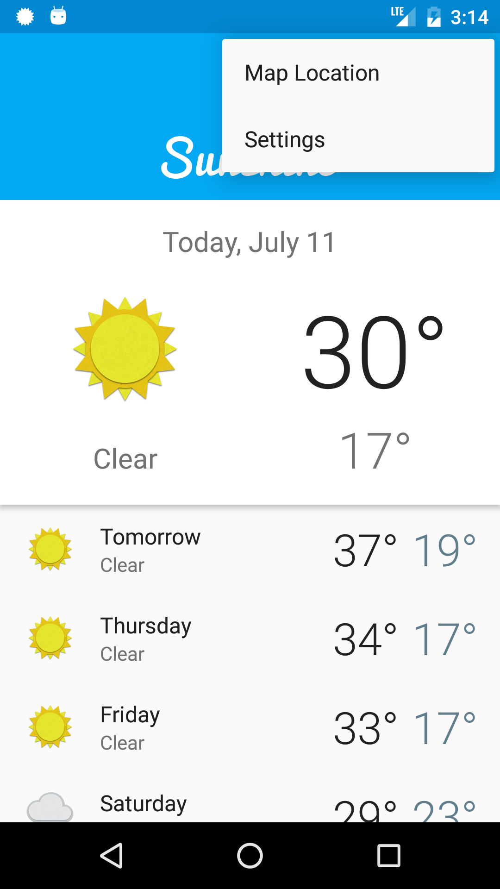

# Udacity Go Ubiquitous (Screenshots)

## Main View First

## Main View Second - Scrolling

## Detail View First

## Detail View Second

## Main View Third

## Notifications

## Settings

## Android Wear

